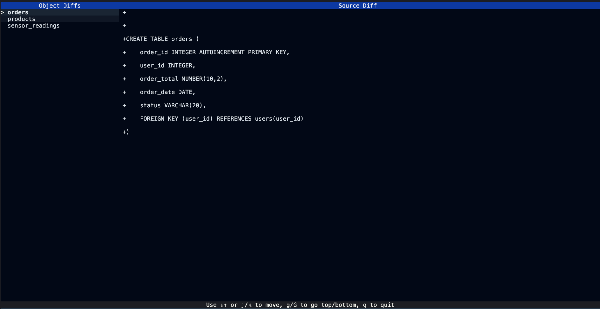

# Snowdiff



A fast, pragmatic TUI tool to compare Snowflake table and view schemas using DDL files.  
Quickly see what tables, views, and columns are missing or different between two environments.

---

## Features

- **Compares two sets of Snowflake DDLs** (source and target)
- **Reports missing tables, views, and columns** in either direction
- **Shows a unified diff** for each differing object (table/view)
- **Handles Snowflake-specific quirks** (e.g., TIMESTAMP_NTZ, unsupported DDLs)
- **Works with DDLs generated by `GET_DDL` or `SHOW CREATE`**
- **Terminal UI** for interactive navigation

---

## Usage

### 1. Prepare Your DDL Files

Export your source and target schema DDLs from Snowflake, for example:

```sql
-- For Target
SELECT GET_DDL('DATABASE', 'MYDB', TRUE);

-- For Source
SELECT GET_DDL('DATABASE', 'MYDB_DEV', TRUE);
```

Save the DDLs to two files, e.g.:

- `ddls/source.sql`
- `ddls/target.sql`

### 2. Build the Tool

```sh
cargo build --release
```

### 3. Run the Tool

By default, the tool loads `ddls/source.sql` and `ddls/target.sql`.  
To run:

```sh
cargo run
```

### 4. TUI Navigation

- **j / k** or **↓ / ↑**: Move up/down the diff list
- **g / G** or **Home / End**: Jump to top/bottom
- **q** or **Esc**: Quit

Selecting an object shows the unified diff for its DDL.

---

## How It Works

- **Preprocesses** DDL to handle Snowflake-specific types and remove unsupported statements
- **Parses** DDL into an AST using [`sqlparser-rs`](https://github.com/sqlparser-rs/sqlparser-rs)
- **Normalizes** database names for cross-environment comparison
- **Diffs** tables, views, and columns (including types)
- **Displays** a unified diff for each object in a TUI

---

## Limitations

- Only compares **tables and views** (not other object types)
- Requires DDLs to be exported from Snowflake
- **No CLI arguments yet**—edit the DDL file paths in `src/main.rs` if needed
- Does **not connect directly to Snowflake**
- DDL parsing is best-effort; some complex DDLs may not be fully supported

---

## Development

- Main logic in `src/`
- TUI in `src/tui.rs`
- DDL parsing in `src/parser.rs`
- Diff logic in `src/differ.rs`
- Types in `src/types.rs`

---

## License

MIT
